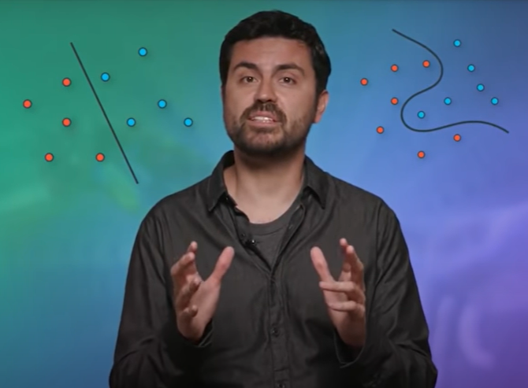

### Basic deep learning concepts and terminology :

## 1- Model

Models built to replicate how the brain processes, memorizes and/or retrieves information.
In neural networks, the model is the collection of weights and biases that transform input into output. 
Neural networks produced trained models that can be deployed to process, classify, cluster and make predictions about data.

In a neural network, inputs, which are typically real values, are fed into the neurons in the network. 
Each neuron has a weight, and the inputs are multiplied by the weight and fed into the activation function.
Each neuron’s output is the input of the neurons in the next layer of the network, and so the inputs cascade through multiple activation functions until eventually, the output layer generates a prediction.
Neural networks rely on nonlinear activation functions, the derivative of the activation function helps the network learn through the backpropagation process.

## 2- Neuron/Node/Perceptron

Perceptron is the basic unit of the neural network that used as a binary classification algorithm, it accepts an input and generates a prediction.

A single perceptron works as a linear binary classifier. 

## 3- MLP
 
A multilayer perceptron (MLP) is a deep, artificial neural network or (DNN). It is composed of more than one perceptron, organized in multiple layers. They are composed of an input layer to receive the signal, an output layer that makes a decision or prediction about the input, and in between those two, an arbitrary number of hidden layers that are the true computational engine of the MLP. MLPs with one hidden layer are capable of approximating any continuous function.

Multi-Layer Perceptrons are perhaps the oldest form of deep neural network. They consist of multiple, fully connected feedforward layers.

## 4- Artificial Neural Networks (ANN)

An Artificial Neural Network (ANN) or "shallow" neural network is a network of neurons or perceptrons that are organized in layers and contain only one hidden layer. Each neuron can make simple decisions, and feeds those decisions to other neurons, organized in interconnected layers.

ANNs mimic the human brain by using artificial neurons and synapses. 

## 5- Deep Neural Networks (DNN) 

A Deep Neural Network or DNN has a structure similar to an artificial neural network, but it has two or more “hidden layers” of neurons that process inputs.
Each neuron accepts part of the input and passes it through the activation function.

## 6- Classifier

A classifier is an algorithm that maps the input data to a specific category. Basically, a classifier is the rules used by the neural network to classify data. 

 
## 7- Classification Problems

A neural network can be used for many different tasks. One of these tasks is classification.

Classification refers to a predictive modeling problem where a class label is predicted for a given example of input data.

Examples of classification problems include:

Given an example, classify if it is spam or not.
Given a handwritten character, classify it as one of the known characters.
Given recent user behavior, classify as churn or not.

## 8- Binary Classification

Binary classification refers to those classification tasks that have two class labels.

Examples include:

Email spam detection (spam or not)
Churn prediction (churn or not)
Conversion prediction (buy or not)

## 9- Multi-Class Classification

Multi-class classification refers to those classification tasks that have more than two class labels.

Examples include:

Face classification.
Plant species classification.
Optical character recognition.

## 10- Label Encoding

Class labels are often string values, e.g. “spam,” “not spam,” and must be mapped to numeric values before being provided to an algorithm for modeling. This is often referred to as label encoding, where a unique integer is assigned to each class label, e.g. “spam” = 0, “no spam” = 1.

* A floating number (e.g. in binary classification: 1.0 or 0.0)
cat → 0.0
dog → 1.0

* One-hot encoding (e.g. in multi-class classification: [0 0 1 0 0])
cat → [1 0 0 0]
dog → [0 1 0 0]
lion → [0 0 1 0]
horse → [0 0 0 1]

* Multi-hot encoding (e.g. in multi-label classification: [1 0 1 0 0])
cat, dog → [1 1 0 0]
dog → [0 1 0 0]
cat, lion → [1 0 1 0]
lion, horse → [0 0 1 1]
cat, dog, lion, horse → [1 1 1 1]

* A vector (array) of integers (e.g. in multi-class classification: [[1], [3]])
cat → 1
dog → 2
lion → 3
horse → 4

## 11- One-Hot Encoding

Used in classification and bag of words. The label for each example is all 0s, except for a 1 at the index of the actual class to which the example belongs.

## 12- Linear regression

Regression refers to a set of methods for modeling the relationship between one or more independent variables and a dependent variable. In the natural sciences and social sciences, the purpose of regression is most often to characterize the relationship between the inputs and outputs. Machine learning, on the other hand, is most often concerned with prediction.

Regression problems pop up whenever we want to predict a numerical value. Common examples include predicting prices (of homes, stocks, etc.), predicting length of stay (for patients in the hospital), demand forecasting (for retail sales), among countless others.

Linear regression is suitable for dependent values which can be fitted with a straight line (linear function).

## 13- Logistic Regression

Logistic regression is a statistical method used for a binary classification problem. The outcome or the prediction will be only one of two possible classes. For example, it can be used for cancer detection problems.

Logistic regression takes an input, passes it through a function called sigmoid function then returns an output of probability between 0 and 1.

## 14- Nonlinear Function

A function that maps input on a nonlinear scale such as sigmoid or tanh. 

## 15- Activation Functions

The activation function is a mathematical equation that determines the output a node(neuron or perceptron) will generate, based upon its input.

It takes in the input from each neuron and transforms it into an output, usually between one and zero or between -1 and one.

## 16- Step Function

A step function is a classic (discrete) activation function used in neural networks which has a binary input.

## 17- Sigmoid Function

The sigmoid function is a continuous activation function that has a smooth gradient and outputs values between zero and one. For very high or low values of the input parameters, the network can be very slow to reach a prediction, called the vanishing gradient problem.

## 18- Softmax Function

Softmax is a special activation function use for output neurons layer. It normalizes outputs for each class between 0 and 1, and returns the probability that the input belongs to a specific class.

## 19- Hyperbolic Tangent (TanH) fnuction

The TanH fnuction is zero-centered making it easier to model inputs that are strongly negative strongly positive or neutral.

## 20- Rectified Linear Unit (ReLU) function

The ReLu function is highly computationally efficient but is not able to process inputs that approach zero or negative.

## 21- N-Dimensions

## 22- Random initialzation 

Referred to the process of assigning random values to weights.

## 23- Weight

Weights (commonly referred to as w) are the learnable parameters of a neural network model.  
In an ANN, each neuron in a layer and is connected to each neuron in the next layer. When the inputs are transmitted between neurons, the weights are applied to the inputs along with the bias.

Weights control the signal (or the strength of the connection) between two neurons. In other words, a weight decides how much influence the input will have on the output.

## 24- Bias

Bias measures how well the model fits the training set. The bias neuron holds the number 1, and makes it possible to move the activation function up, down, left and right on the number graph.

## 25- Variance

Variance reflects how well the model fits unseen examples in the validation set.  
A high variance means the neural network is not able to correctly predict for new examples it hasn’t seen before.

## 26- Epochs

An epoch is a complete pass through all the training dataset (one cycle through the full training dataset).

An epoch is often mixed up with an iteration. Iterations is the number of batches or steps through partitioned packets of the training data, needed to complete one epoch.

One Epoch is when an ENTIRE dataset is passed forward and backward through the neural network only ONCE. 

## 27- Batch

It is the process of dividing the dataset into parts or groups. And the batch size refers to the total number of training examples present in a single batch.

## 28- Iterations

Iterations is the number of batches needed to complete one epoch.

Many iterations can occur before an epoch is over.

For example if BatchSize is 100 and data size is 1,000 an epoch will have 10 iterations. If trained for 30 epochs there will be 300 iterations.

## 29- Probability

## 30- Cross-Entropy

Cross-entropy loss, or log loss, measures the performance of a classification model whose output is a probability value between 0 and 1.

A perfect model would have a log loss of 0.

## 31- Error Function

The error function (also called the loss or cost function) calculates the error, the difference between the real actual value and the model's predicted output.

When training the model, the objective is to minimize the error function and bring output as close as possible to the correct value.

## 32- Learning Rate

learning rate is a configurable hyperparameter used in the training of neural networks that represents the amount that the weights are updated during training (gradient descent process).

In simple words learning rate determines how fast weights (in case of a neural network) or the cooefficents (in case of linear regression or logistic regression) change.

Smaller learning rates require more training epochs given the smaller changes made to the weights each update, whereas larger learning rates result in rapid changes and require fewer training epochs.

A learning rate that is too large can cause the model to converge too quickly to a suboptimal solution, whereas a learning rate that is too small can cause the process to get stuck.

The challenge of training deep learning neural networks involves carefully selecting the learning rate. It may be the most important hyperparameter for the model.

## 33- Gradient Descent

Stochastic gradient descent is an optimization algorithm that estimates the error gradient (the loss function) for the current state of the model using examples from the training dataset, and trying to minimize this error by updating the weights of the model using the back-propagation of errors algorithm.

Descending a gradient has two aspects: choosing the direction to step in (momentum) and choosing the size of the step (learning rate).

Stochastic is simply a synonym for “random.” A stochastic process is a process that involves a random variable, such as randomly initialized weights. 

## 34- Derivative

A derivative is a continuous description of how a function changes with small changes in one or multiple variables.

## 35- Local Minimum

The point in a curve which is minimum when compared to its preceding and succeeding points.

## 36- Global Minimum 

The point in a curve which is minimum when compared to all points in the curve.

For a curve there can be more than one local minima, but it does have only one global minima.

In gradient descent, these local and global minima are useed in order to decrease the loss functions.

## 37- Momentum

Momentum is a very popular technique that is used along with gradient descent. Instead of using only the gradient of the current step to guide the search, momentum also accumulates the gradient of the past steps to determine the direction to go.

Beside others, momentum is known to speed up learning and to help not getting stuck in local minima.

## 38- Feedforward

The forward pass takes the inputs, passes them through the network, and allows each neuron to react to a fraction of the input. Neurons generate their outputs and pass them on to the next layer, until eventually the network generates an output or a prediction.

## 39- Backpropagation

The algorithm is used to effectively train a neural network through a method called chain rule. In simple terms, after each forward pass through a network, backpropagation performs a backward pass while adjusting the model’s parameters (weights and biases).

Backpropagation tracks the derivatives of the activation functions in each successive neuron, to find weights that brings the loss function to a minimum (gradient descent), which will generate the best prediction. 

## 40- Prediction

Prediction refers to the output of an algorithm after it has been trained on a historical dataset and applied to new data when forecasting the likelihood of a particular outcome.

## 41- Discrete Predictions

## 42- Continuous Predictions 

## 43- Inputs

Source data fed into the neural network, with the goal of making a decision or prediction about the data.

## 44- Outputs

Neural networks generate their predictions in the form of a set of real values or boolean decisions. 
Each output value is generated by one of the neurons in the output layer.

## 45- Training dataset

A training dataset (60% of the original dataset) is a group of examples that are used for learn, and it is fed to the neural network during a training phase.

## 46- Validation dataset

A validation dataset (20% of the original dataset) is a group of examples that are used to tune the parameters (architecture). 

For example, to choose the number of hidden units in a neural network or determine a stopping point for the back-propagation algorithm. Also The validation dataset may play a role in other forms of model preparation, such as feature selection.

## 47- Testing dataset 

A test dataset (20% of the original data set) is a group of examples that are used to finally check the overall performance of a neural network (performance evaluation).

## 48- Hyperparameter

A hyperparameter is a setting that affects the structure or operation of the neural network. In real deep learning projects, tuning hyperparameters is the primary way to build a network that provides accurate predictions for a certain problem.

Common hyperparameters include the number of hidden layers, the activation function, and how many times training should be repeated (epochs). Different values of hyperparameters can have a major impact on the performance of the network.

## 49- Maximum Likelihood

Maximum likelihood estimation (MLE) is a method of estimating the parameters of a probability distribution by maximizing a likelihood function.

The objective of Maximum Likelihood Estimation is to find the set of parameters (theta) that maximize the likelihood function.

## 50- Underfitting

Underfitting is a high bias and low variance problem, happens when the neural network is not able to accurately predict for the training set, not to mention for the validation set.

## 51- Overfitting

Overfitting is a low bias and high variance problem, happens when the neural network is good at learning its training set, but is not able to generalize its predictions to additional, unseen examples. 

## 52- Generalization

One of the major advantages of neural networks is their ability to generalize. Generalization is a term used to describe a model’s ability to react to new data.

To reach the best generalization, the dataset should be split into three parts:

* The training set 
* The validation set 
* A test set 

## 53- Regularization

Regularization is a technique which makes slight modifications to the learning algorithm such that the model generalizes better. This in turn improves the model’s performance on the unseen data as well which helps to avoid overfitting in neural networks.

It works by adding a term to the error function equation, intended to decrease the weights and biases, smooth outputs and make the network less likely to overfit.

## 54- Dropout

Dropout is a hyperparameter used for regularization in neural networks. Like all regularization techniques, its purpose is to prevent overfitting. Dropout randomly makes nodes in the neural network “drop out” by setting them to zero, which encourages the network to rely on other features that act as signals. That, in turn, creates more generalizable representations of data.

## 55- Early stopping

A common method to avoid overfitting in neural networks. Early stopping training the network, monitoring the error on the validation set after each iteration, and stopping training when the network starts to overfit the data (when the test error starts to increase).

## 56- Accuracy

Accuracy is a metric that generally describes how the model performs across all classes. It is useful when all classes are of equal importance. It is calculated as the ratio between the number of correct predictions to the total number of predictions.

## 57- Precision

Precision is a metric that calculated as the ratio between the number of Positive samples correctly classified to the total number of samples classified as Positive (either correctly or incorrectly). 
The precision measures the model's accuracy in classifying a sample as positive.

## 58- Recall

The recall is a metric that calculated as the ratio between the number of Positive samples correctly classified as Positive to the total number of Positive samples. 
The recall measures the model's ability to detect Positive samples. 
The higher the recall, the more positive samples detected.

 

## 59- MNIST

MNIST is the “hello world” of deep-learning datasets, stands for “Modified National Institute of Standards and Technology.” Everyone uses MNIST to test their neural networks, just to see if the net actually works at all. MNIST contains 60,000 training examples and 10,000 test examples of the handwritten numerals 0-9. These images are 28x28 pixels, which means they require 784 nodes on the first input layer of a neural network.

 